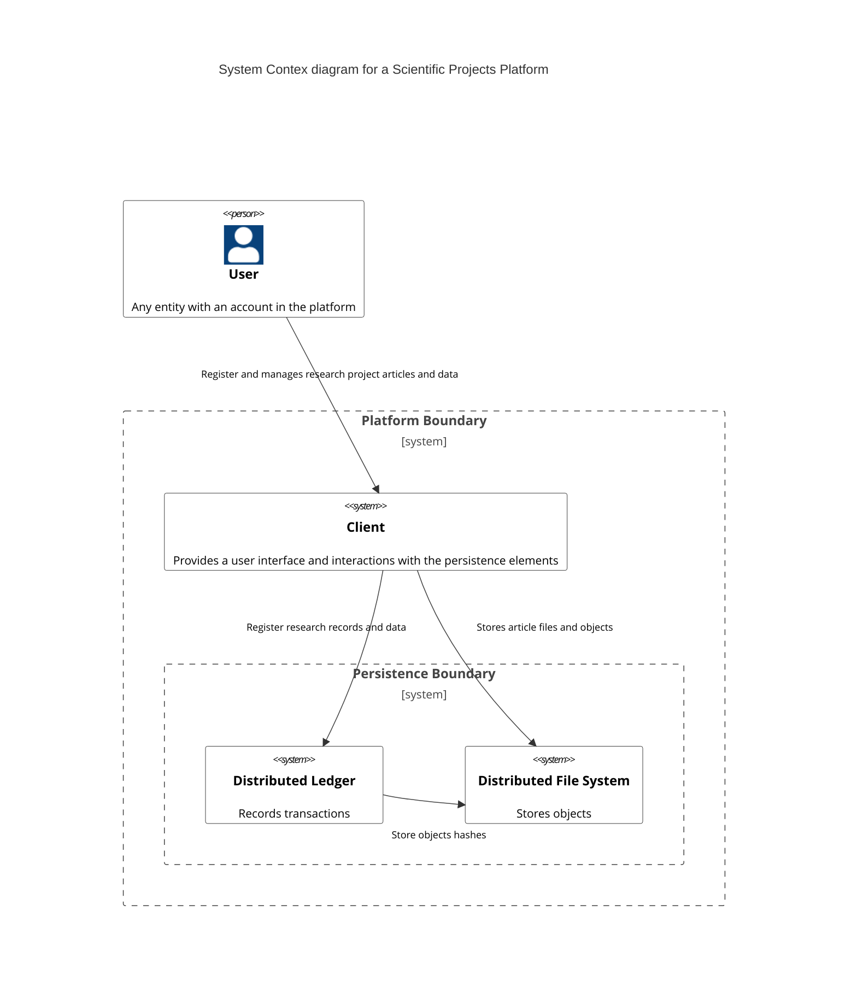

```mermaid
C4Context
title System Contex diagram for a Scientific Projects Platform


    Person(user, "User", "Any entity with an account in the platform")

    Boundary(b0, "Platform Boundary")
    {
        System(client, "Client", "Provides a user interface and interactions with the persistence elements")
Boundary(c1, "Persistence Boundary")
                    {
                        System(distributed_ledger, "Distributed Ledger", "Records transactions")
                        
                        System(IPFS, "Distributed File System", "Stores objects")

                    }
    }


Rel(user, client,"Register and manages research project articles and data")


Rel(client, distributed_ledger,"Register research records and data")

Rel(client, IPFS,"Stores article files and objects")

Rel(distributed_ledger, IPFS,"Store objects hashes")

UpdateElementStyle(user, $fontColor="black", $bgColor="white", $borderColor="black")

UpdateElementStyle(client,$fontColor="black", $bgColor="white", $borderColor="black")

UpdateElementStyle(distributed_ledger,$fontColor="black", $bgColor="white", $borderColor="black")

UpdateElementStyle(IPFS,$fontColor="black", $bgColor="white", $borderColor="black")

UpdateRelStyle(user, client, $textColor="black", $offsetX="-160",$offsetY="-40")

UpdateRelStyle(client, distributed_ledger, $textColor="black", $offsetX="-130",$offsetY="-40")

UpdateRelStyle(client, IPFS, $textColor="black", $offsetX="0",$offsetY="-40")

UpdateRelStyle(distributed_ledger, IPFS, $textColor="black", $offsetX="-40",$offsetY="40")


```